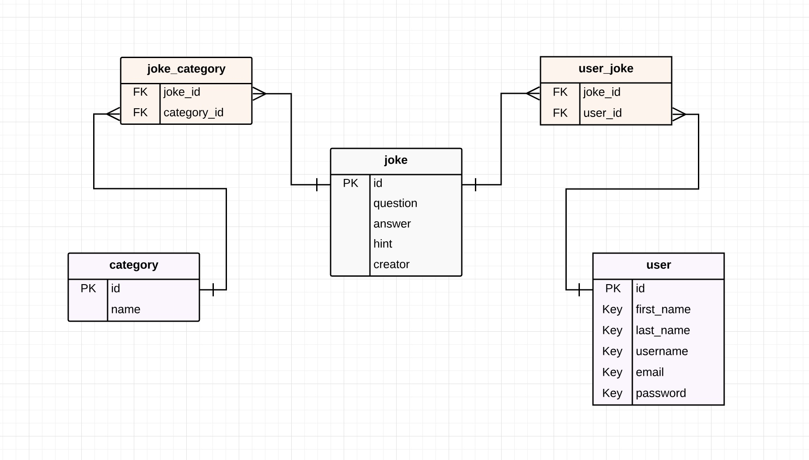
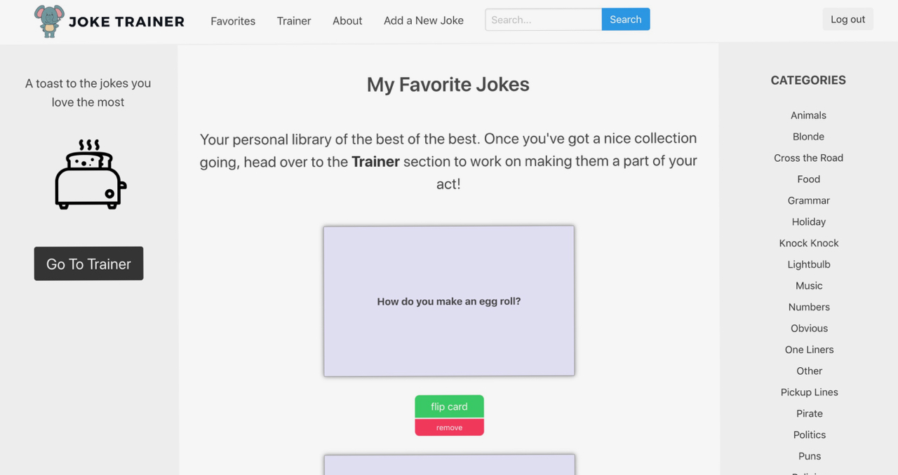
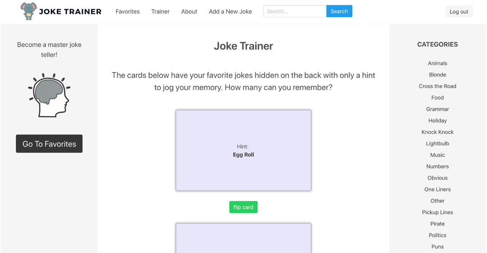

# Welcome to Joke Trainer!

## Things you can do in Joke Trainer-

- Browse the built-in library of animated jokes by keyword search or category 
- Register an account
- Add jokes to your collection of favorites
- Use the Joke Trainer feature to commit your favorite jokes to memory with hints and flashcards
- Add and integrate your own jokes with the existing library

Joke Trainer ERD:

## To access Joke Trainer on the web:

Joke Trainer is available online at <a href="http://www.joketrainer.com">http://www.joketrainer.com</a>
 
If you prefer to tour the full site without creating your own user profile, you may use the following demonstration account:

<strong>username:</strong> demo 
<strong>password:</strong> tourthesite

## Sections in Joke Trainer

### Navigation Bar

- Links to home page, favorites page, trainer page, registration and login/logout
- Search bar

### Home Page

- Left column contains links to descriptions of the various site functionalities
- Center column has a random "Joke of the Moment"
- Right column contains links to the various joke categories. Once you are logged in, the top category contains your personal jokes

### Favorites

- Once you're logged into an account, each joke will have a blue button that lets you add the joke to your list of favorites, which appear on the favorites page

### Trainer

- The coolest part of the site. The Trainer page is where you can use Joke Trainer to help yourself memorize your favorite jokes. You'll find only a hint on the front of the card, with the entire joke on the back. Use these flashcards to build your repertoire as a master joke teller.

### Add Your Own Jokes

- Once you're logged into an account, you can add as many jokes as you want to the database. Your jokes will integrate into the existing library, but will only be visible to you when you're logged in.